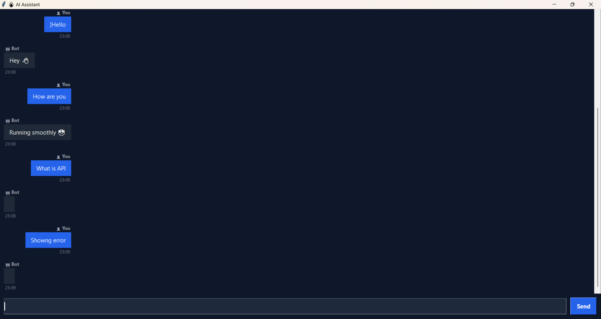

<h1 align="center">⚡ Ultra AI Chatbot</h1>
<p align="center">💻 Desktop App | 🤖 Chatbot | 🎯 Clean UI Project</p>
<p align="center">A modern desktop chatbot with a clean WhatsApp-style UI built using Python</p>
<p align="center">🚀 Built with Python | Clean UI | Smooth Performance</p>

<p align="center">
  
  
  
  
</p>

---

## 🚀 Overview

Ultra AI Chatbot is a desktop-based chat application built using Python and Tkinter.
It simulates real-time messaging with a modern UI and smooth user experience.

---

## ✨ Features

* 💬 WhatsApp-style chat interface
* ↔️ Left-right aligned messages
* ⏱ Timestamp for each message
* ⚡ Smooth & lag-free performance (multithreading)
* 🧠 Smart commands (time, date, history, etc.)
* 🎯 Clean and modern dark UI

---

## 🚀 Key Highlights
- Built a real-time chat UI using Tkinter  
- Implemented multithreading for smooth performance  
- Designed user-bot message alignment system  
- Packaged as standalone desktop application (.exe)

---

## 🎥 Demo



---

## 💬 Example Interaction

User: Hello  
Bot: Hey 👋  

User: What is API  
Bot: API stands for Application Programming Interface  

User: time  
Bot: Current time is HH:MM:SS  
---

## 📂 Project Structure

```
UltraAi-Chatbot/
 ├── chatbot.py
 ├── README.md
 └── screenshot.png
```

---

## ⚙️ How It Works

* User enters a message
* Bot processes input using predefined logic
* Generates response based on keywords/conditions
* Displays response in chat UI with timestamp

---

## 🛠 Tech Stack

* Python
* Tkinter
* Threading
* PyInstaller

---

## 📦 Requirements

* Python 3.x

---

## 📦 Installation & Usage

### ▶ Run using Python

```bash
python chatbot.py
```

---

## 💻 Run as Application

* Open `dist/chatbot.exe`
* Double click to launch the app

---

## 🎯 Use Cases

* Beginner-friendly Python project
* Understanding GUI development
* Learning chat application logic
* Desktop application development

---

## 🔮 Future Improvements

* 🤖 AI Integration (Gemini / OpenAI)
* 🎤 Voice input system
* 🗄 Database-based memory
* 🌐 Internet-based responses

---

## 👨‍💻 Author

**Kartik Shukla**

---

## ⭐ Support

If you like this project, consider giving it a ⭐ on GitHub!
